# Jarkom Modul 1 2026 — K-09

| Nama | NRP |
|---|---|
| Sultan Ahmad Maulana Bahyshidqi | 5027250170 |
| Muhammad Razzan Azizi Djauhari | 5027251086 |

## Serial Experiments Lain — The Wired

Pada praktikum Modul 1, kami membangun jaringan **The Wired** menggunakan GNS3. **Lain** berperan sebagai router utama yang menghubungkan tiga segmen jaringan, sedangkan **Alice, Mika, Chisa, Knights, dan Eiri** berperan sebagai client. Router Lain terhubung ke internet melalui node NAT pada interface `eth0`.

Prefix IP kelompok yang digunakan adalah **10.68.x.x** dengan pembagian subnet:

- Switch 1: `10.68.1.0/24`
- Switch 2: `10.68.2.0/24`
- Switch 3: `10.68.3.0/24`

### TOPOLOGI JARINGAN

<p align="center">
  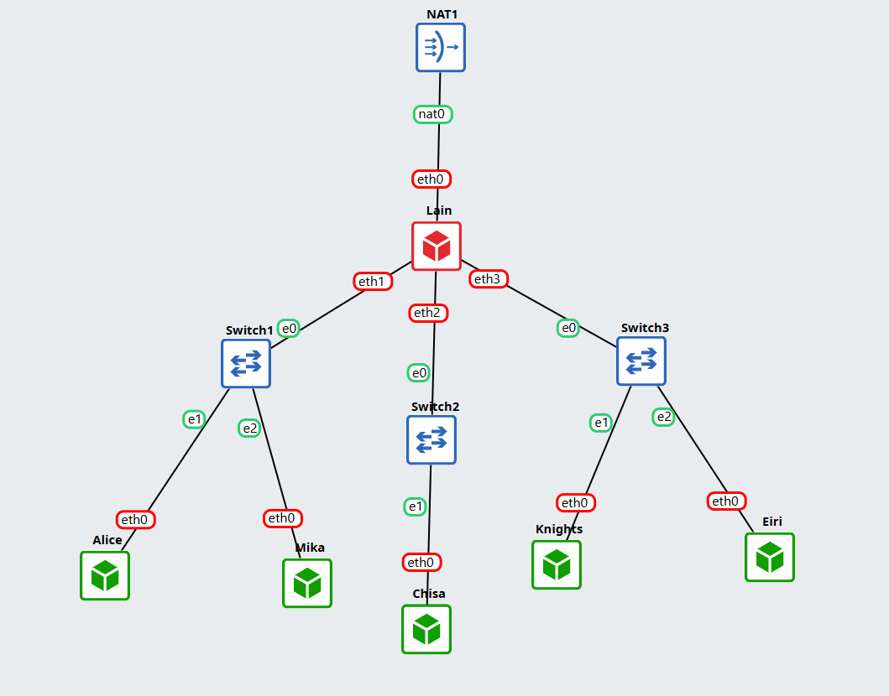
</p>

<p align="center">
  <i>Topologi jaringan The Wired pada GNS3.</i>
</p>

---

## 1. Membangun Topologi The Wired

Lain berperan sebagai router yang menghubungkan tiga switch. Switch 1 terhubung ke **Alice** dan **Mika**, Switch 2 terhubung ke **Chisa**, sedangkan Switch 3 terhubung ke **Knights** dan **Eiri**.

Node Linux dibuat menggunakan Docker image yang diperbolehkan pada praktikum, yaitu `ardhptr21/alpinet:latest` dan/atau `ardhptr21/debinet:latest`.

Pembagian interface pada router Lain:

```text
eth0 -> NAT / Internet
eth1 -> Switch 1
eth2 -> Switch 2
eth3 -> Switch 3
```

Skema alamat IP:

| Perangkat | Interface | IP Address | Gateway |
|---|---|---|---|
| Lain | eth0 | DHCP | Otomatis |
| Lain | eth1 | `10.68.1.1/24` | - |
| Alice | eth0 | `10.68.1.2/24` | `10.68.1.1` |
| Mika | eth0 | `10.68.1.3/24` | `10.68.1.1` |
| Lain | eth2 | `10.68.2.1/24` | - |
| Chisa | eth0 | `10.68.2.2/24` | `10.68.2.1` |
| Lain | eth3 | `10.68.3.1/24` | - |
| Knights | eth0 | `10.68.3.2/24` | `10.68.3.1` |
| Eiri | eth0 | `10.68.3.3/24` | `10.68.3.1` |

Konfigurasi router Lain:

```text
auto eth0
iface eth0 inet dhcp

auto eth1
iface eth1 inet static
    address 10.68.1.1
    netmask 255.255.255.0

auto eth2
iface eth2 inet static
    address 10.68.2.1
    netmask 255.255.255.0

auto eth3
iface eth3 inet static
    address 10.68.3.1
    netmask 255.255.255.0
```

Contoh konfigurasi client Alice:

```text
auto eth0
iface eth0 inet static
    address 10.68.1.2
    netmask 255.255.255.0
    gateway 10.68.1.1
```

Setelah konfigurasi dilakukan, alamat IP diverifikasi menggunakan:

```bash
ip -br a
```

<p align="center">
  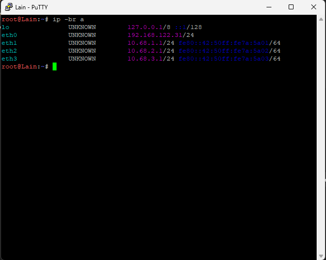
</p>

<p align="center">
  <i>Hasil verifikasi alamat IP pada router Lain. Interface eth1, eth2, dan eth3 masing-masing digunakan sebagai gateway untuk tiga subnet jaringan.</i>
</p>

---

## 2. Menghubungkan Router Lain ke Internet

Interface `eth0` pada Lain dihubungkan ke node **NAT** GNS3 dan menggunakan DHCP:

```text
auto eth0
iface eth0 inet dhcp
```

Dengan DHCP, Lain memperoleh alamat IP secara otomatis dari jaringan NAT. Konektivitas internet diuji dengan:

```bash
ping -c 3 8.8.8.8
```

Jika ping berhasil, maka router Lain sudah memiliki akses ke internet publik.

<p align="center">
  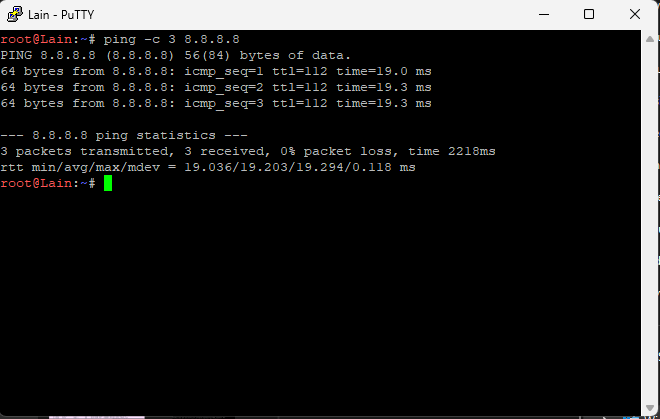
</p>

<p align="center">
  <i>Pengujian koneksi internet pada router Lain menggunakan ping ke 8.8.8.8.</i>
</p>

---

## 3. Mengaktifkan Routing Antar-Subnet

Client berada pada tiga subnet berbeda sehingga komunikasi antar-subnet harus dilewatkan melalui Lain.

IP forwarding diaktifkan pada router Lain menggunakan:

```bash
sysctl -w net.ipv4.ip_forward=1
```

Verifikasi:

```bash
cat /proc/sys/net/ipv4/ip_forward
```

Output yang diharapkan:

```text
1
```

Setelah itu dilakukan pengujian antar-subnet, misalnya:

```bash
# Dari Alice ke Chisa
ping -c 3 10.68.2.2

# Dari Alice ke Knights
ping -c 3 10.68.3.2
```

Jika ping berhasil, Lain telah meneruskan paket antar-interface dengan benar.

<p align="center">
  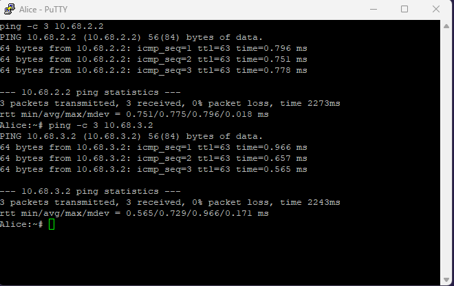
</p>

<p align="center">
  <i>Pengujian komunikasi antar-subnet melalui router Lain.</i>
</p>

---

## 4. Memberikan Akses Internet kepada Seluruh Client

Agar semua client dapat mengakses internet melalui Lain, digunakan **NAT Masquerade** dan forwarding pada `iptables`.

Konfigurasi pada Lain:

```bash
iptables -t nat -A POSTROUTING -o eth0 -j MASQUERADE

iptables -A FORWARD -i eth1 -o eth0 -j ACCEPT
iptables -A FORWARD -i eth2 -o eth0 -j ACCEPT
iptables -A FORWARD -i eth3 -o eth0 -j ACCEPT
iptables -A FORWARD -i eth0 -m state --state ESTABLISHED,RELATED -j ACCEPT
```

Setelah itu client diuji dengan:

```bash
ping -c 3 8.8.8.8
```

Untuk resolusi nama domain, DNS resolver dikonfigurasi. Pada lingkungan praktikum, resolver yang digunakan adalah:

```bash
echo "nameserver 192.168.122.1" > /etc/resolv.conf
```

Kemudian dilakukan pengujian:

```bash
ping -c 3 google.com
```

Jika ping ke `8.8.8.8` dan `google.com` berhasil, maka routing, NAT, dan DNS client telah bekerja.

<p align="center">
  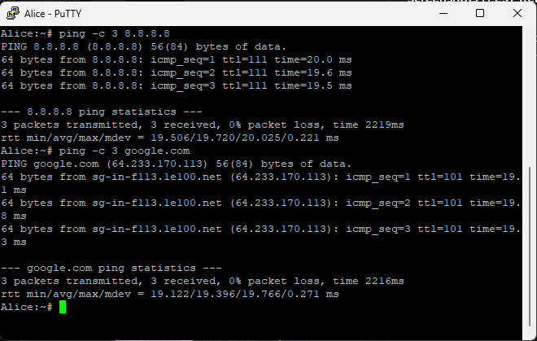
</p>

<p align="center">
  <i>Client berhasil mengakses internet dan melakukan resolusi DNS ke google.com.</i>
</p>

---

## 5. Membuat Konfigurasi Tetap Berfungsi Setelah Restart

Untuk menjaga konfigurasi router setelah restart, perintah penting dapat dijalankan kembali ketika interface aktif. Contoh pada interface `eth0` Lain:

```text
auto eth0
iface eth0 inet dhcp
    up sysctl -w net.ipv4.ip_forward=1
    up iptables -t nat -A POSTROUTING -o eth0 -j MASQUERADE
    up iptables -A FORWARD -i eth1 -o eth0 -j ACCEPT
    up iptables -A FORWARD -i eth2 -o eth0 -j ACCEPT
    up iptables -A FORWARD -i eth3 -o eth0 -j ACCEPT
    up iptables -A FORWARD -i eth0 -m state --state ESTABLISHED,RELATED -j ACCEPT
```

Pada router Lain dibuat script `/root/cek_status.sh`:

```bash
#!/bin/sh

echo "=== STATUS INTERFACE ==="
ip -br a

echo
echo "=== STATUS NAT ==="
iptables -t nat -L -v -n
```

Script dibuat executable:

```bash
chmod +x /root/cek_status.sh
```

Kemudian setelah Stop dan Start node, dilakukan pengecekan:

```bash
/root/cek_status.sh
```

Jika IP interface dan rule NAT tetap muncul serta client masih dapat mengakses internet, konfigurasi dinyatakan berhasil bertahan setelah restart.

<p align="center">
  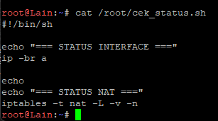
</p>

<p align="center">
  <i>Isi script /root/cek_status.sh untuk memeriksa interface dan konfigurasi NAT.</i>
</p>

<p align="center">
  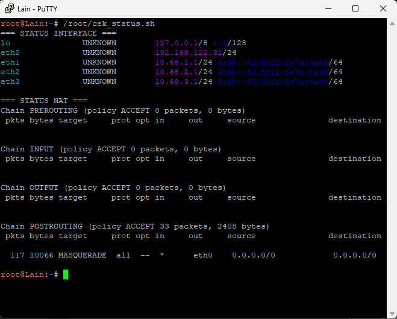
</p>

<p align="center">
  <i>Hasil pengecekan setelah node Lain direstart menunjukkan IP interface dan NAT Masquerade tetap aktif.</i>
</p>

---

## 6. Analisis Traffic DNS dan ICMP pada Node Mika

File `traffic_protocol7.sh` dijalankan pada node Mika. Script tersebut menghasilkan traffic **ICMP** melalui `ping` serta traffic **DNS** melalui `nslookup` dan `dig`.

Script dijalankan dengan:

```bash
chmod +x /root/traffic_protocol7.sh
/root/traffic_protocol7.sh
```

Capture dilakukan pada link **Mika ↔ Switch 1** menggunakan Wireshark. Display filter yang digunakan:

```text
dns or icmp
```

Hasil capture menunjukkan:

- DNS query dan response untuk beberapa domain.
- ICMP Echo Request dan Echo Reply dari aktivitas ping.
- Total packet pada capture: **52 packet**.
- Packet yang lolos display filter: **48 packet (92.3%)**.

Contoh traffic yang terlihat:

```text
10.68.1.3 -> 8.8.8.8    DNS Query
8.8.8.8 -> 10.68.1.3    DNS Response

10.68.1.3 -> 1.1.1.1    ICMP Echo Request
1.1.1.1 -> 10.68.1.3    ICMP Echo Reply
```

<p align="center">
  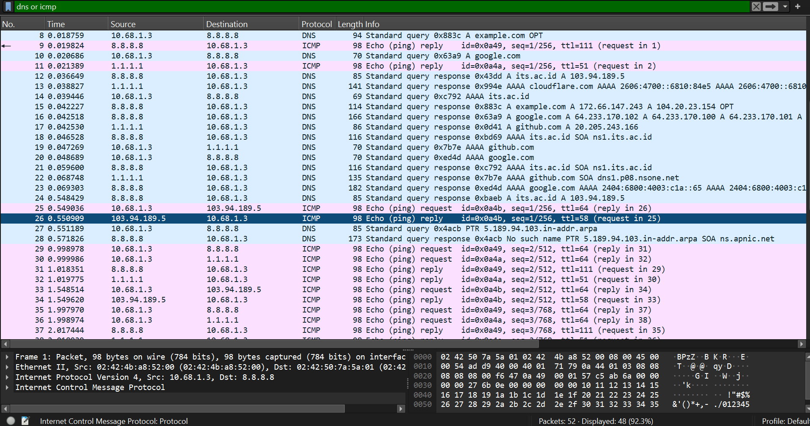
</p>

<p align="center">
  <i>Hasil capture Wireshark pada Mika menggunakan display filter dns or icmp.</i>
</p>

---

## 7. Konfigurasi FTP Server pada Chisa

Chisa dikonfigurasi sebagai **FTP Server** menggunakan `vsftpd` dengan shared folder:

```text
/var/wired/data
```

Kebijakan akses:

| User | Hak Akses |
|---|---|
| alice | Read + Write |
| mika | Read-only |
| eiri | Blacklist / login ditolak |

Pada Alpinet, instalasi `vsftpd` dilakukan dengan:

```bash
apk update
apk add vsftpd
```

User dibuat dengan:

```bash
adduser alice
adduser mika
adduser eiri
```

Group untuk akses read-only Mika:

```bash
addgroup wiredftp
addgroup mika wiredftp
```

Folder FTP:

```bash
mkdir -p /var/wired/data
chown alice:wiredftp /var/wired/data
chmod 750 /var/wired/data
```

Konfigurasi penting `vsftpd`:

```text
listen=YES
anonymous_enable=NO
local_enable=YES
write_enable=YES

chroot_local_user=YES
allow_writeable_chroot=YES
local_root=/var/wired/data

userlist_enable=YES
userlist_deny=YES
userlist_file=/etc/vsftpd.user_list

seccomp_sandbox=NO
```

Eiri dimasukkan ke blacklist:

```bash
echo "eiri" > /etc/vsftpd.user_list
```

Karena container Alpinet tidak boot menggunakan OpenRC, `vsftpd` dijalankan langsung:

```bash
/usr/sbin/vsftpd /etc/vsftpd/vsftpd.conf &
```

### Pengujian Alice

Pada Alice dibuat file:

```bash
echo "signal from alice" > /root/signal_alice.txt
```

Alice terhubung ke Chisa:

```bash
ftp 10.68.2.2
```

Setelah login sebagai `alice`, file di-upload menggunakan:

```text
put /root/signal_alice.txt signal_alice.txt
```

Upload berhasil ditandai dengan:

```text
226 Transfer complete.
```

File dapat diverifikasi di Chisa:

```bash
ls -l /var/wired/data
```

### Pengujian Eiri

Eiri mencoba login ke FTP Server Chisa menggunakan akun `eiri`. Server dapat dihubungi, tetapi proses autentikasi menghasilkan:

```text
Login failed
```

Hal ini membuktikan bahwa blacklist user Eiri bekerja.

<p align="center">
  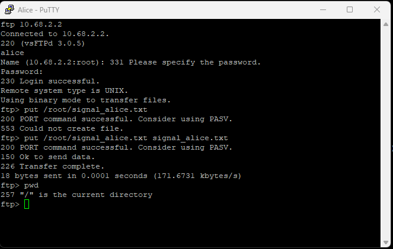
</p>

<p align="center">
  <i>Alice berhasil mengunggah file signal_alice.txt ke FTP Server Chisa.</i>
</p>

<p align="center">
  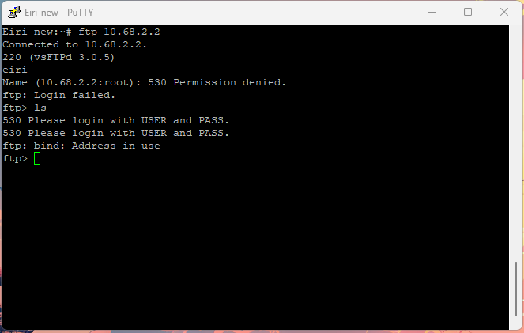
</p>

<p align="center">
  <i>Login FTP Eiri ditolak karena user Eiri telah dimasukkan ke blacklist.</i>
</p>

---

## 8. Upload `knights_report.txt` dan Analisis FTP PASV

Knights terhubung sebagai FTP client ke Chisa menggunakan akun `alice`.

File yang di-upload adalah:

```text
knights_report.txt
```

Capture Wireshark dimulai pada link Knights sebelum proses upload.

Knights login:

```bash
ftp 10.68.2.2
```

Kemudian passive mode diaktifkan dan file dikirim:

```text
passive
put /root/knights_report.txt knights_report.txt
```

Pada Wireshark ditemukan:

```text
Request: PASV
Response: 227 Entering Passive Mode (10,68,2,2,106,111)
Request: STOR knights_report.txt
Response: 226 Transfer complete.
```

Perintah **STOR** digunakan oleh FTP untuk melakukan upload file.

Port data TCP pada mode PASV dihitung dari dua angka terakhir response `227`:

```text
Port = (106 × 256) + 111
     = 27136 + 111
     = 27247
```

Wireshark juga menunjukkan pembentukan koneksi TCP menuju port `27247`.

Kesimpulan:

- Perintah upload: **STOR**
- Status sukses: **226 Transfer complete**
- Port data PASV: **27247**


<p align="center">
  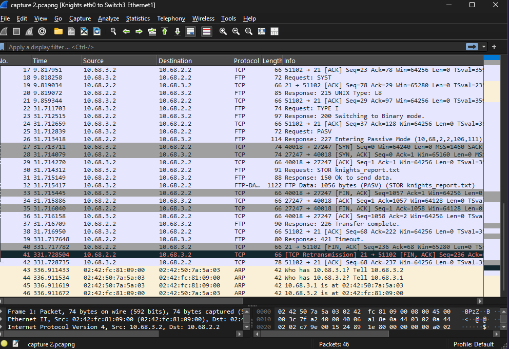
</p>

<p align="center">
  <i>Capture Wireshark menunjukkan PASV, response 227, koneksi data pada port 27247, perintah STOR knights_report.txt, dan response 226 Transfer complete.</i>
</p>

---

## 9. Read-Only FTP untuk Mika

File yang digunakan adalah:

```text
protocol7_manifesto.txt
```

File ditempatkan pada FTP Server Chisa dan diberikan permission agar group `wiredftp` dapat membaca file:

```bash
chown alice:wiredftp /var/wired/data/protocol7_manifesto.txt
chmod 640 /var/wired/data/protocol7_manifesto.txt
```

Mika login ke FTP Server Chisa:

```bash
ftp 10.68.2.2
```

File di-download menggunakan:

```text
get protocol7_manifesto.txt
```

Download berhasil karena Mika memiliki hak baca.

Untuk membuktikan Mika tidak memiliki hak tulis, dibuat konfigurasi per-user pada vsftpd.

Pada `/etc/vsftpd/vsftpd.conf` ditambahkan:

```text
user_config_dir=/etc/vsftpd_user_conf
```

Kemudian dibuat:

```bash
mkdir -p /etc/vsftpd_user_conf
```

File `/etc/vsftpd_user_conf/mika` berisi:

```text
write_enable=NO
```

Setelah `vsftpd` dijalankan ulang, Mika mencoba upload:

```text
put /root/mika_test.txt mika_test.txt
```

Upload ditolak dengan:

```text
550 Permission denied
```

Hal ini membuktikan bahwa user Mika bersifat **read-only**: dapat melakukan download tetapi tidak dapat upload.

<p align="center">
  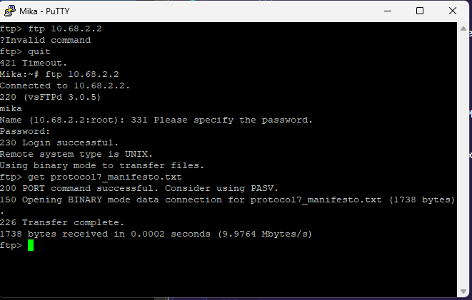
</p>

<p align="center">
  <i>Mika berhasil mengunduh protocol7_manifesto.txt dari FTP Server Chisa.</i>
</p>

<p align="center">
  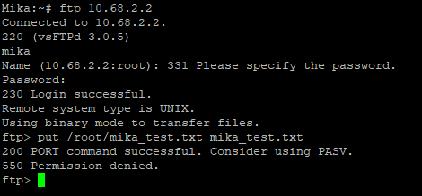
</p>

<p align="center">
  <i>Percobaan upload oleh Mika ditolak dengan response 550 Permission denied.</i>
</p>

---

## 10. Analisis ICMP Knights ke Chisa

Knights melakukan pengujian koneksi ke Chisa menggunakan:

```bash
ping -c 77 -s 128 -i 0.3 10.68.2.2
```

Parameter:

- `-c 77`: mengirim 77 packet.
- `-s 128`: payload ICMP sebesar 128 byte.
- `-i 0.3`: interval antar-packet 0,3 detik.

Hasil pengujian:

```text
77 packets transmitted, 77 received, 0% packet loss
rtt min/avg/max/mdev = 0.428/0.614/0.980/0.122 ms
```

Sehingga:

- Packet loss: **0%**
- RTT minimum: **0.428 ms**
- RTT rata-rata: **0.614 ms**
- RTT maksimum: **0.980 ms**

Pada Wireshark digunakan filter:

```text
icmp
```

Hasil analisis ICMP:

| Jenis | Type | Code |
|---|---:|---:|
| Echo Request | 8 | 0 |
| Echo Reply | 0 | 0 |

Echo Request dikirim dari Knights ke Chisa, sedangkan Echo Reply dikirim kembali dari Chisa ke Knights.

<p align="center">
  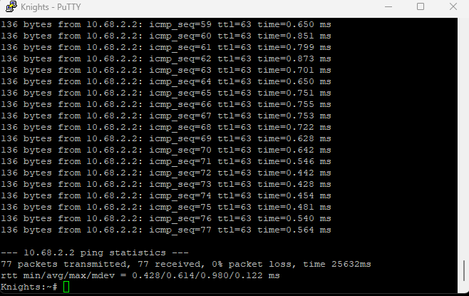
</p>

<p align="center">
  <i>Hasil pengiriman 77 paket ICMP dari Knights ke Chisa menunjukkan 0% packet loss dengan RTT min/avg/max sebesar 0.428/0.614/0.980 ms.</i>
</p>

<p align="center">
  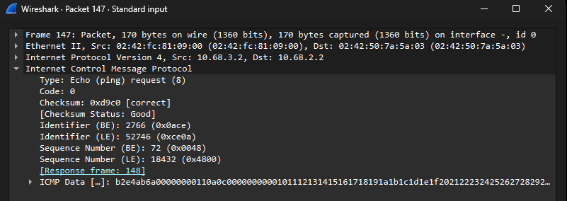
</p>

<p align="center">
  <i>ICMP Echo Request memiliki Type 8 dan Code 0.</i>
</p>

<p align="center">
  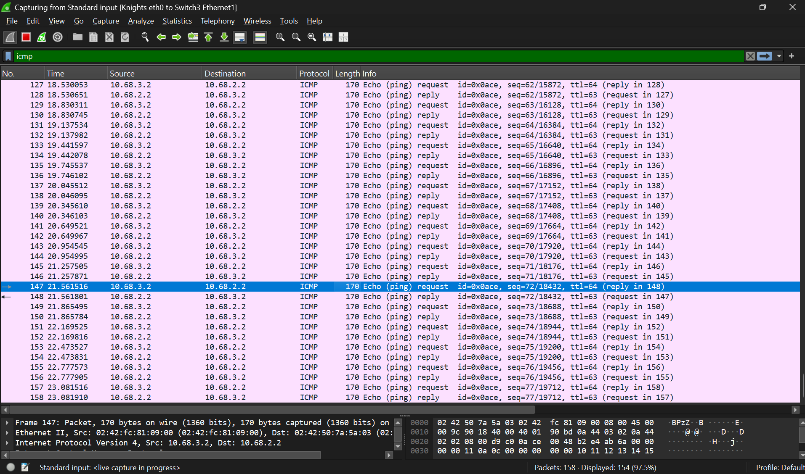
</p>

<p align="center">
  <i>ICMP Echo Reply memiliki Type 0 dan Code 0.</i>
</p>

## 11. Analisis Telnet dan Kredensial Plaintext

Pada node Chisa dijalankan layanan Telnet pada port 23. Untuk pengujian dibuat akun:

```text
Username : phantom_user
Password : wired_ghost
```

Layanan Telnet pada Chisa terlebih dahulu diverifikasi dalam keadaan listen pada port 23.

<p align="center">
  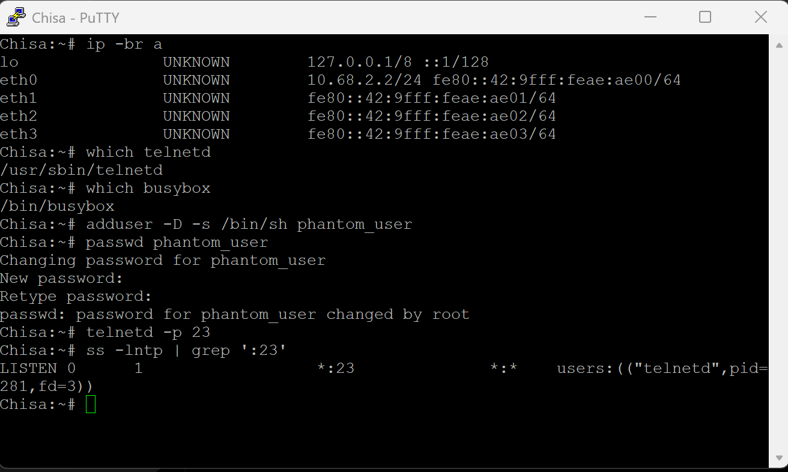
</p>

<p align="center">
  <i>Layanan Telnet pada node Chisa aktif dan listen pada port 23.</i>
</p>

Setelah itu Eiri melakukan koneksi Telnet ke Chisa dan login menggunakan akun `phantom_user`.

<p align="center">
  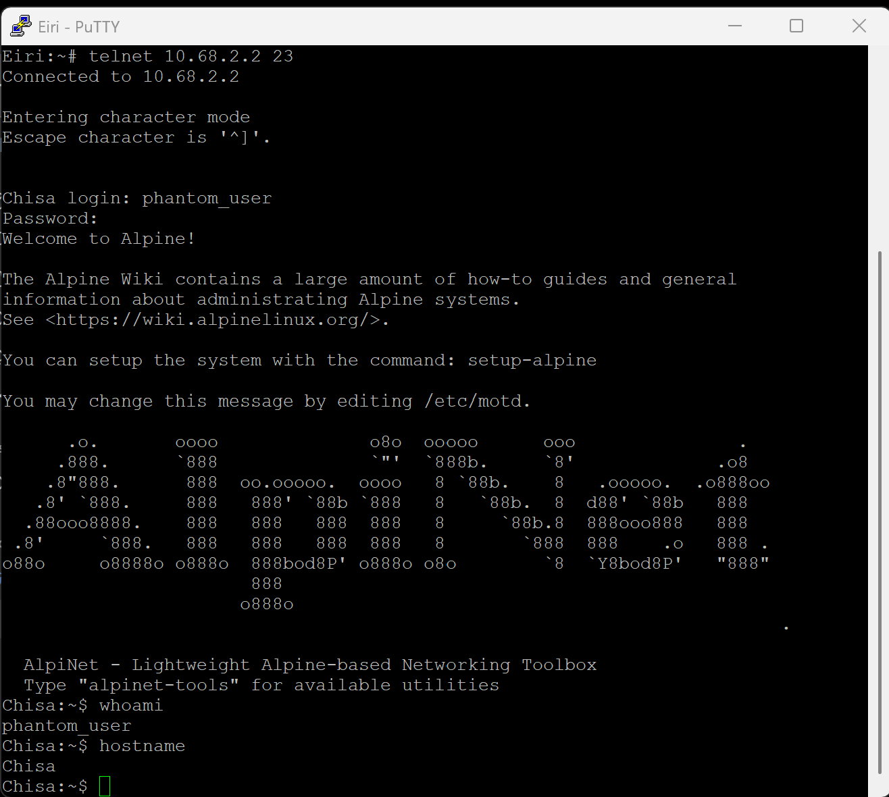
</p>

<p align="center">
  <i>Eiri berhasil melakukan login Telnet ke node Chisa.</i>
</p>

Traffic Telnet kemudian dianalisis menggunakan Wireshark. Melalui fitur **Follow TCP Stream**, username dan password dapat terlihat dalam bentuk plaintext.

<p align="center">
  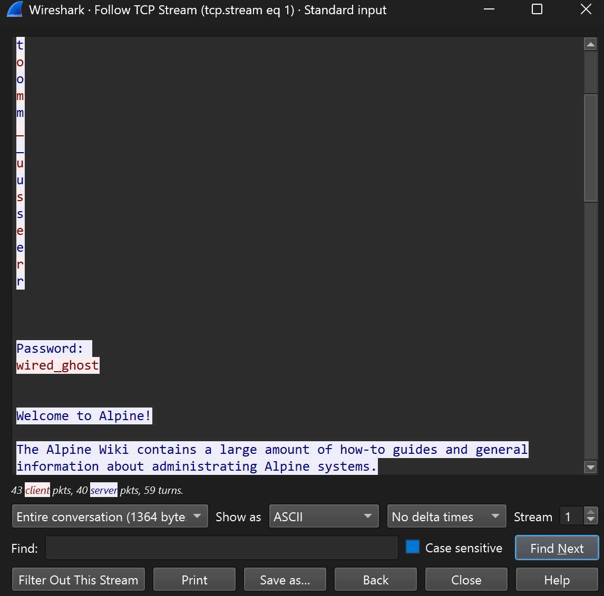
</p>

<p align="center">
  <i>Kredensial Telnet dapat dibaca langsung pada Follow TCP Stream karena Telnet tidak mengenkripsi data autentikasi.</i>
</p>

Saat proses login, input keyboard juga terlihat dikirim per karakter dalam beberapa segmen TCP. Hal ini terjadi karena Telnet bekerja secara interaktif, sehingga karakter yang diketik dapat langsung dikirim ke server tanpa menunggu satu baris input selesai.

<p align="center">
  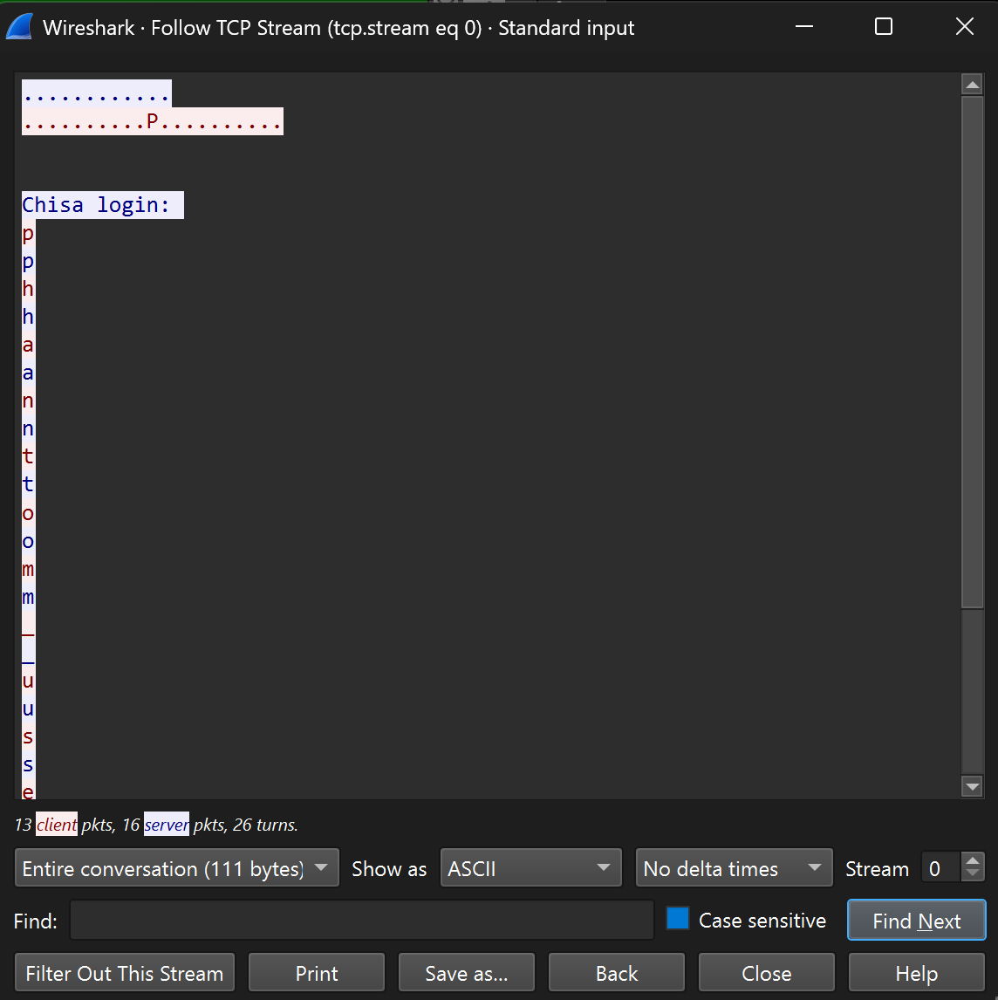
</p>

<p align="center">
  <i>Karakter input Telnet terlihat dikirim pada paket TCP secara terpisah.</i>
</p>

---

## 12. Pemindaian Port Knights Menggunakan Netcat

Dari node Alice dilakukan pengecekan beberapa port pada node Knights menggunakan Netcat.

Perintah yang digunakan:

```bash
nc -vz 10.68.3.2 22
nc -vz 10.68.3.2 80
nc -vz 10.68.3.2 7777
```

Hasil pengujian menunjukkan:

```text
Port 22   -> terbuka
Port 80   -> terbuka
Port 7777 -> tertutup
```

<p align="center">
  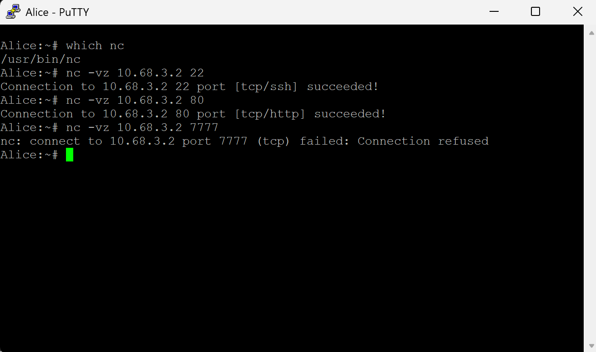
</p>

<p align="center">
  <i>Netcat menunjukkan port 22 dan 80 terbuka, sedangkan koneksi ke port 7777 ditolak.</i>
</p>

Pada node Knights juga diverifikasi bahwa layanan SSH dan HTTP sedang listen.

<p align="center">
  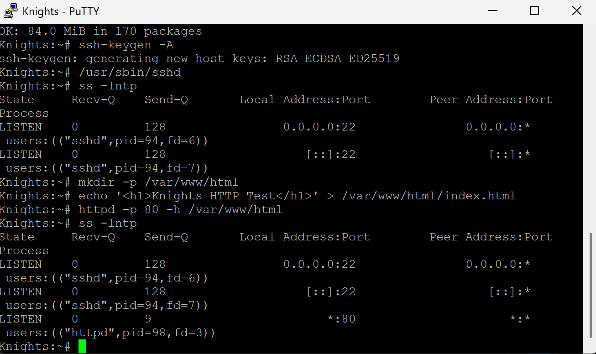
</p>

<p align="center">
  <i>Port 22 dan 80 pada node Knights berada dalam kondisi listen.</i>
</p>

Traffic kemudian dianalisis melalui Wireshark. Pada port terbuka, paket SYN dari Alice dibalas dengan **SYN, ACK**. Sebaliknya, koneksi menuju port 7777 yang tertutup dibalas dengan **RST, ACK**.

<p align="center">
  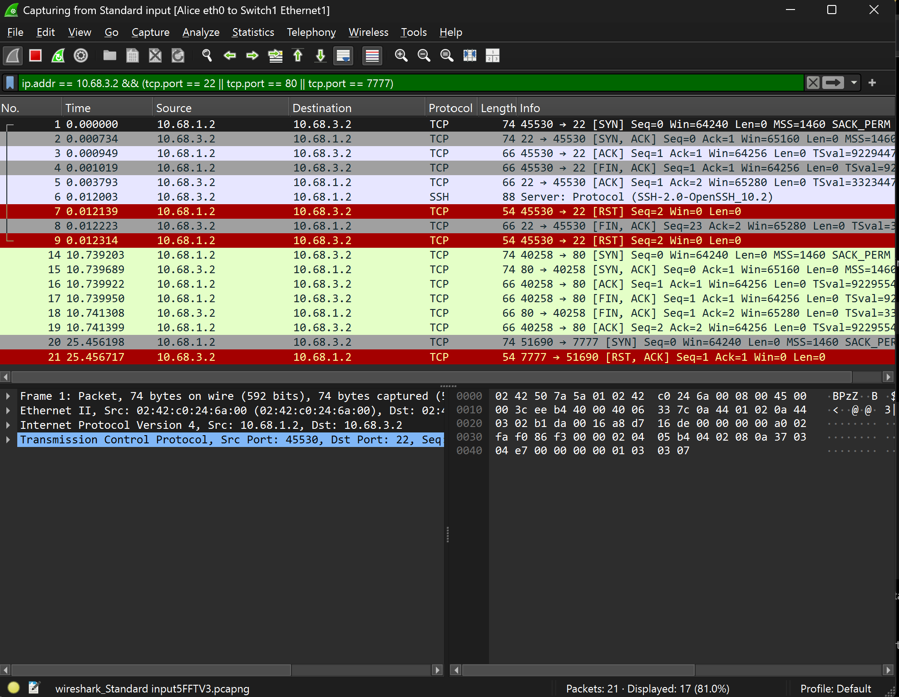
</p>

<p align="center">
  <i>Perbedaan response TCP antara port terbuka yang mengirim SYN-ACK dan port tertutup yang mengirim RST-ACK.</i>
</p>

---

## 13. SSH Public Key Authentication pada Knights

Untuk administrasi jarak jauh yang lebih aman, SSH pada node Knights dikonfigurasi menggunakan public key authentication.

Pada Knights dibuat user:

```bash
adduser -D -s /bin/sh mika_admin
```

Pada Mika dibuat pasangan key ED25519 menggunakan:

```bash
ssh-keygen -t ed25519
```

<p align="center">
  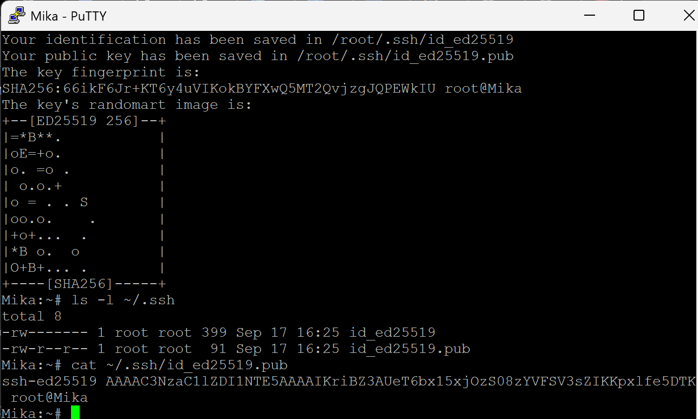
</p>

<p align="center">
  <i>Pembuatan pasangan public key dan private key ED25519 pada node Mika.</i>
</p>

Public key dari Mika kemudian disimpan pada:

```text
/home/mika_admin/.ssh/authorized_keys
```

Permission directory dan file SSH diatur dengan:

```bash
chmod 700 /home/mika_admin/.ssh
chmod 600 /home/mika_admin/.ssh/authorized_keys
chown -R mika_admin:mika_admin /home/mika_admin/.ssh
```

<p align="center">
  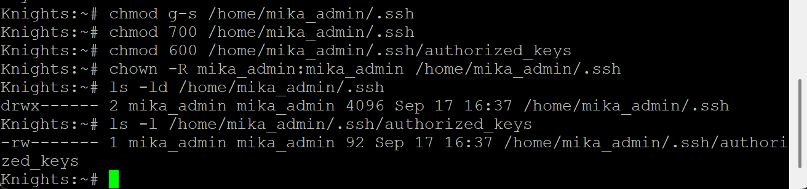
</p>

<p align="center">
  <i>Public key Mika telah dipasang pada authorized_keys milik user mika_admin.</i>
</p>

Konfigurasi SSH kemudian diatur menjadi:

```text
PubkeyAuthentication yes
PasswordAuthentication no
```

<p align="center">
  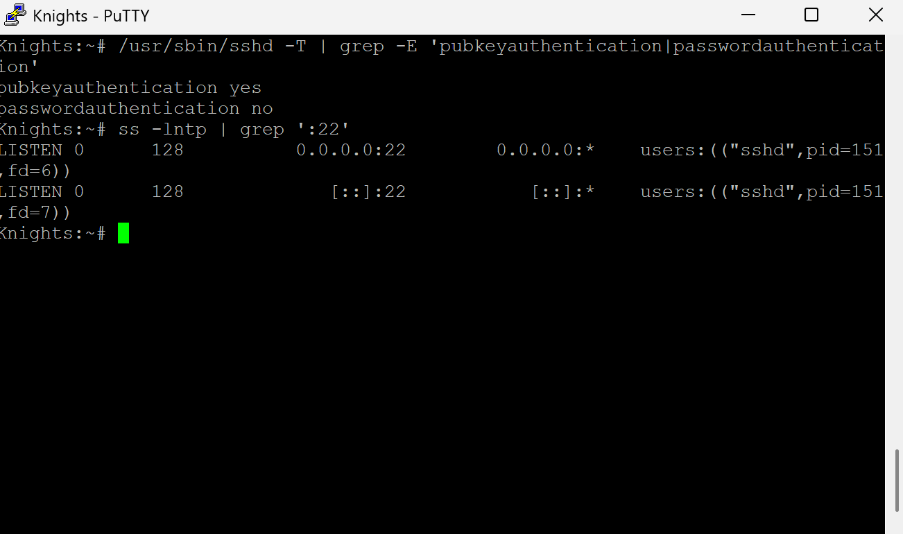
</p>

<p align="center">
  <i>SSH server dikonfigurasi untuk menerima public key authentication dan menolak password authentication.</i>
</p>

### Kendala

Pada percobaan awal, koneksi SSH masih meminta password walaupun public key sudah dipasang.

<p align="center">
  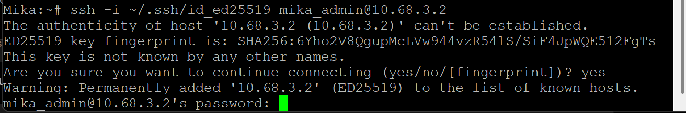
</p>

Setelah dilakukan pengecekan, ditemukan masalah pada status akun dan permission home directory. Akun `mika_admin` kemudian diperbaiki dan permission disesuaikan.

<p align="center">
  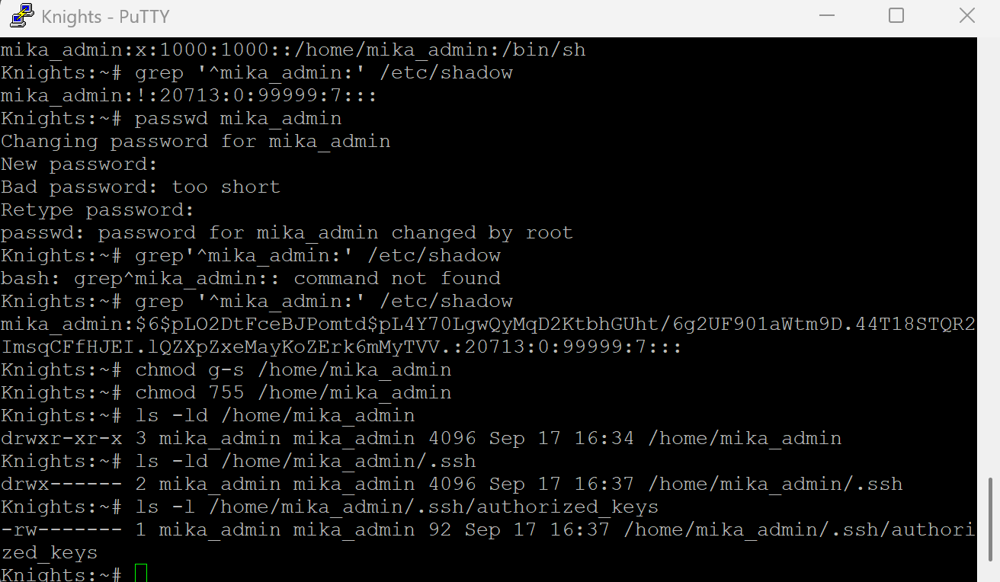
</p>

Setelah konfigurasi diperbaiki, login menggunakan SSH key berhasil dilakukan.

<p align="center">
  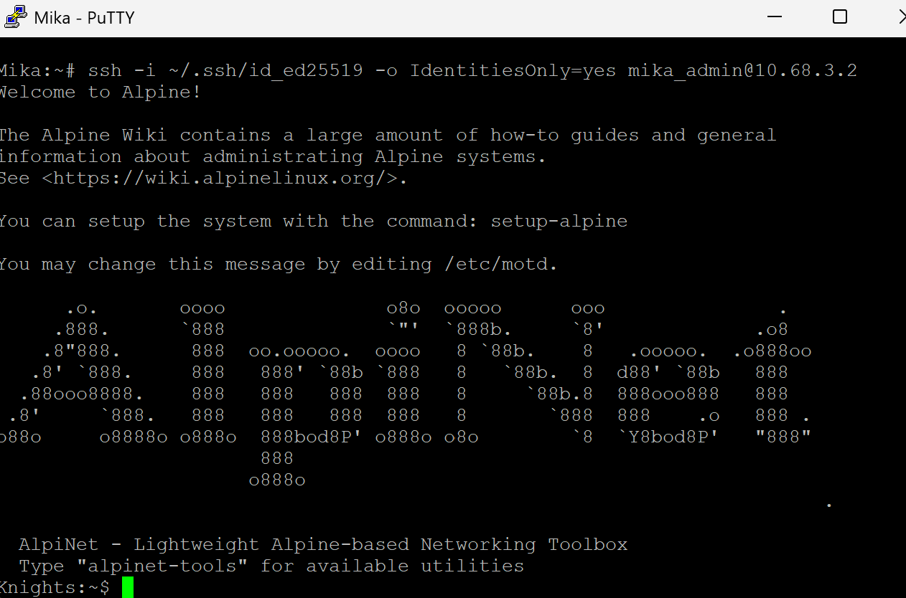
</p>

Koneksi final diverifikasi menggunakan:

```bash
ssh -i ~/.ssh/id_ed25519 -o IdentitiesOnly=yes mika_admin@10.68.3.2
```

<p align="center">
  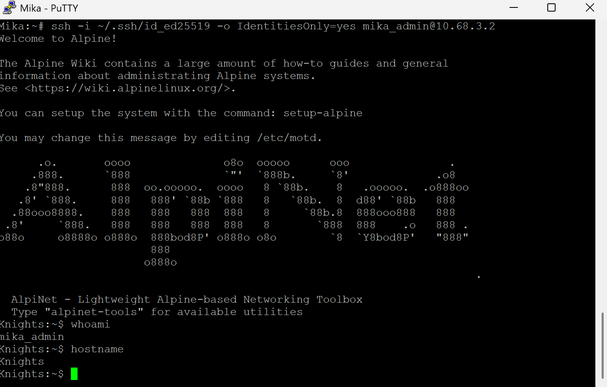
</p>

<p align="center">
  <i>User mika_admin berhasil login ke Knights menggunakan SSH public key authentication.</i>
</p>

Percobaan login menggunakan password juga ditolak setelah `PasswordAuthentication` dinonaktifkan.

<p align="center">
  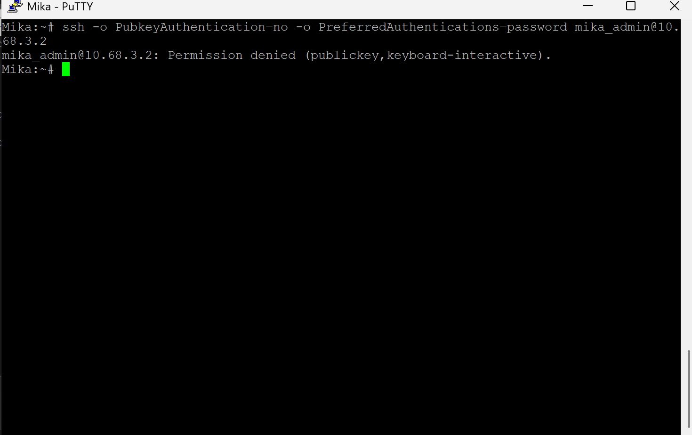
</p>

Pada Wireshark terlihat proses **Protocol Version Exchange** dan **Key Exchange**. Berbeda dengan Telnet, kredensial dan isi sesi SSH tidak dapat dibaca sebagai plaintext karena komunikasi setelah proses negosiasi dilindungi oleh enkripsi.

<p align="center">
  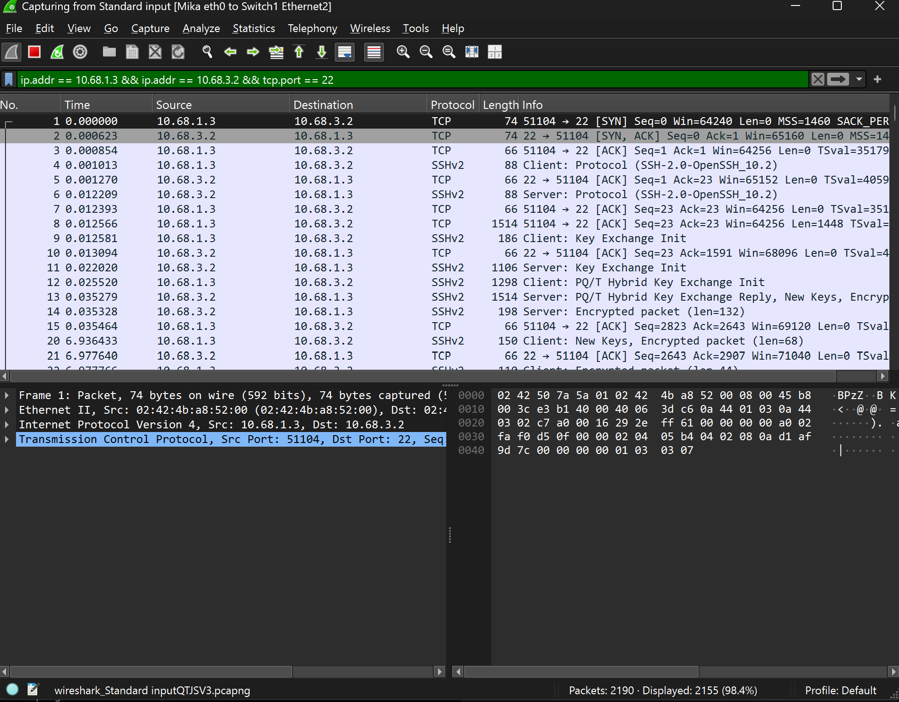
</p>

<p align="center">
  <i>Traffic SSH memperlihatkan proses protocol exchange dan key exchange sebelum komunikasi terenkripsi berlangsung.</i>
</p>

---

## 14. Analisis HTTP Brute Force

File capture `wired_bruteforce.pcapng` dianalisis menggunakan Wireshark. Untuk melihat percobaan login yang dilakukan berulang kali digunakan filter:

```text
http.request.method == "POST"
```

Dari traffic tersebut diperoleh:

```text
IP attacker : 172.26.7.50
Target      : 172.26.7.100:8080
User        : lain_admin
Password    : wired_pr0tocol_7
Web server  : Apache/2.4.62
```

<p align="center">
  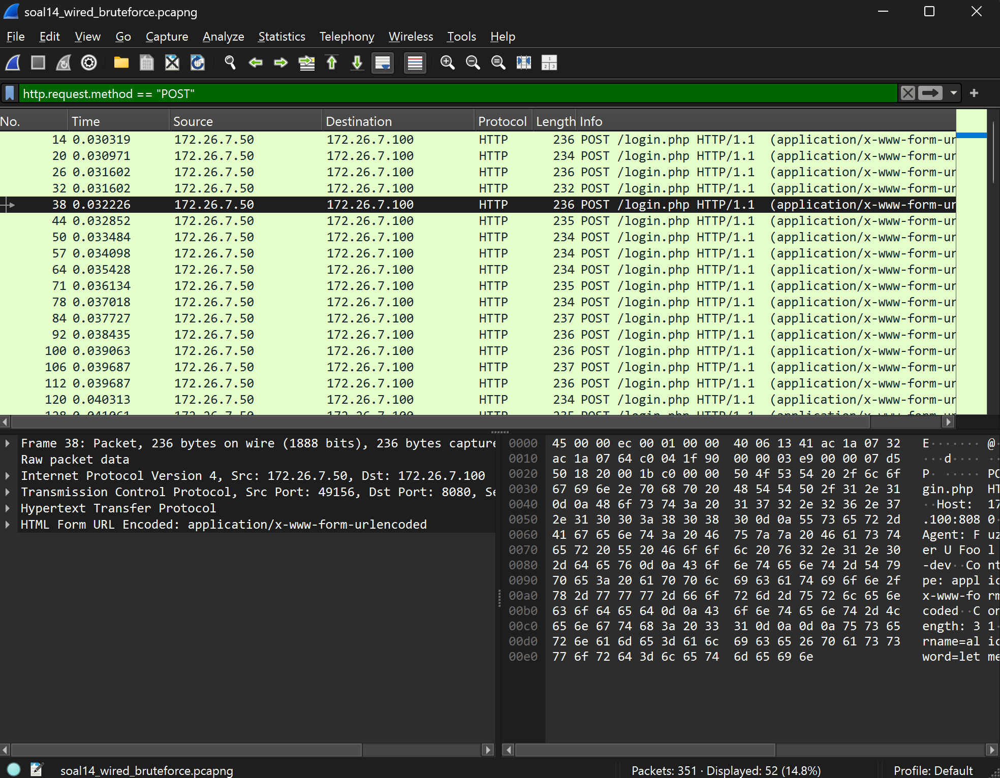
</p>

<p align="center">
  <i>Traffic HTTP POST berulang dari attacker 172.26.7.50 menuju web server 172.26.7.100:8080.</i>
</p>

Percobaan login yang berhasil ditemukan pada frame terakhir dari rangkaian brute force.

<p align="center">
  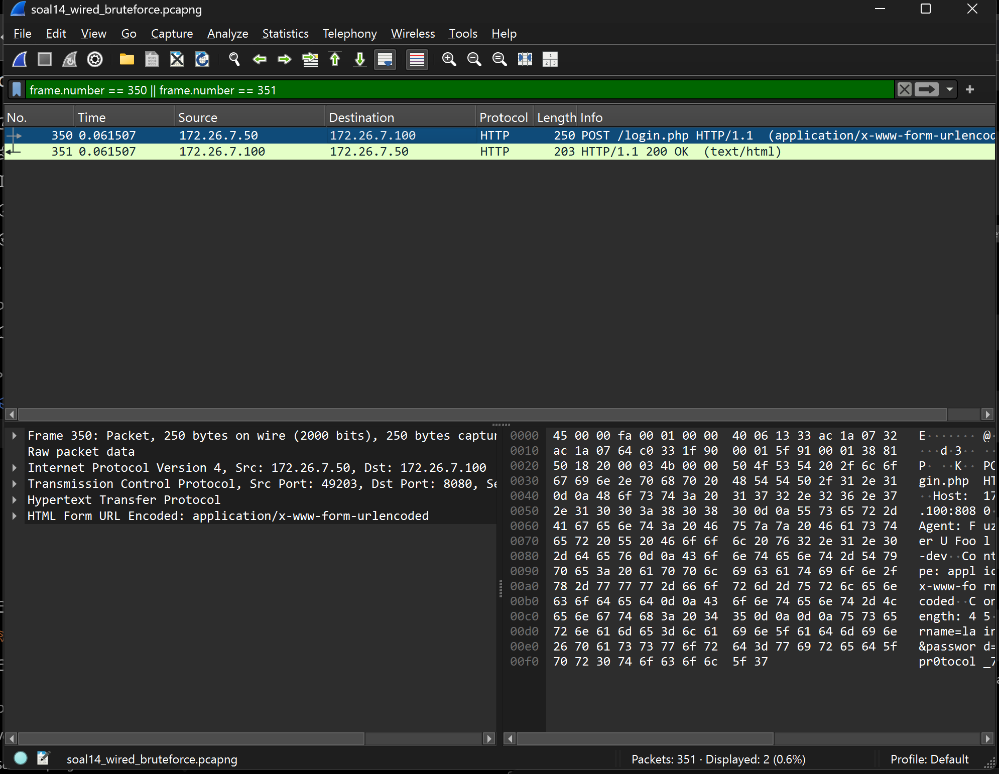
</p>

Header response HTTP juga menunjukkan bahwa web server menggunakan Apache versi 2.4.62.

<p align="center">
  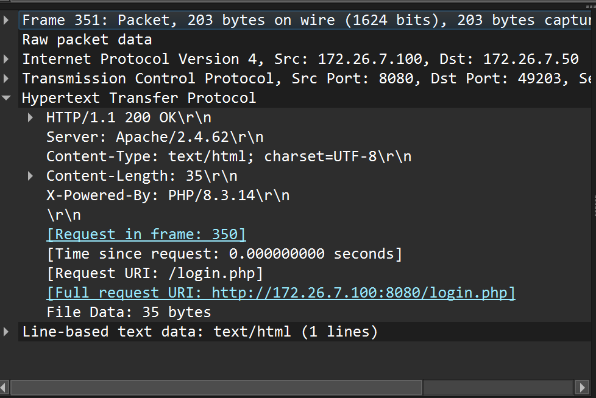
</p>

Hasil analisis kemudian divalidasi melalui socket server dan seluruh jawaban diterima.

<p align="center">
  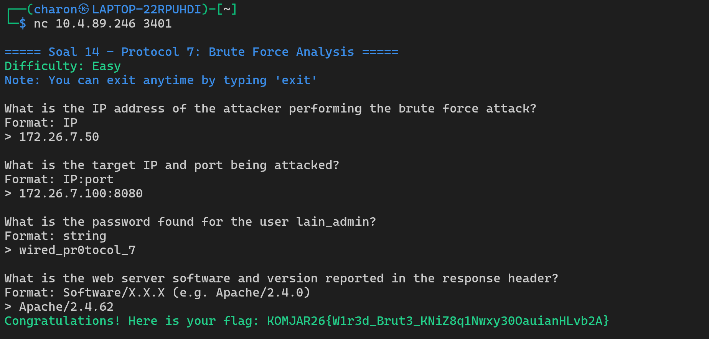
</p>

---

## 15. USB HID Keystroke Decoding

File `wired_usb_hid.pcap` dianalisis untuk mengidentifikasi perangkat USB HID dan data keyboard yang terekam.

Dari USB Device Descriptor diperoleh:

```text
Vendor ID      : 0x046d
Product ID     : 0xc31c
Device address : 7
```

<p align="center">
  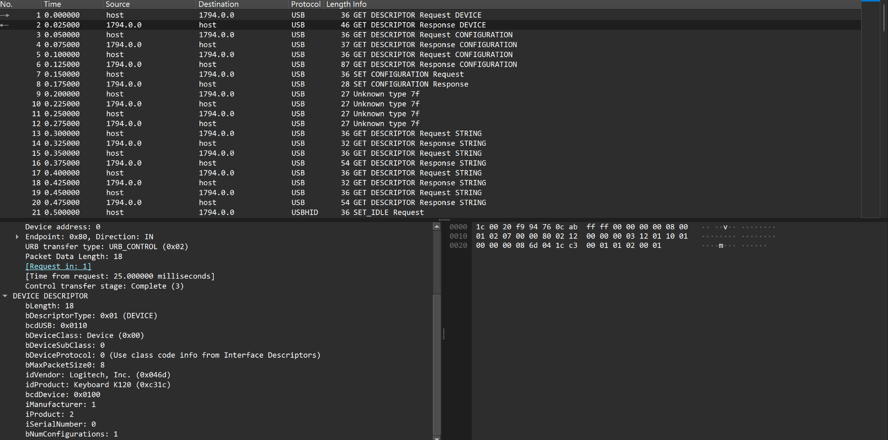
</p>

<p align="center">
  <i>USB Device Descriptor menunjukkan Vendor ID dan Product ID perangkat keyboard.</i>
</p>

Data keystroke ditemukan pada field `usb.capdata`.

<p align="center">
  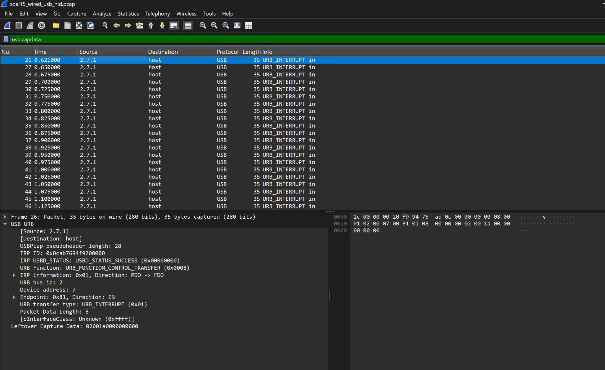
</p>

Setelah kode HID keyboard diterjemahkan, pesan yang diperoleh adalah:

```text
Wired_Protocol_7_is_alive_2026
```

### Kendala

Pada awalnya `tshark` tidak tersedia pada Kali Linux. Percobaan instalasi melalui `apt update` juga mengalami error `503 Service Unavailable`. Sebagai alternatif digunakan `tshark.exe` yang sudah tersedia bersama instalasi Wireshark di Windows untuk mengekstrak nilai `usb.capdata`.

Hasil akhir kemudian divalidasi pada socket server.

<p align="center">
  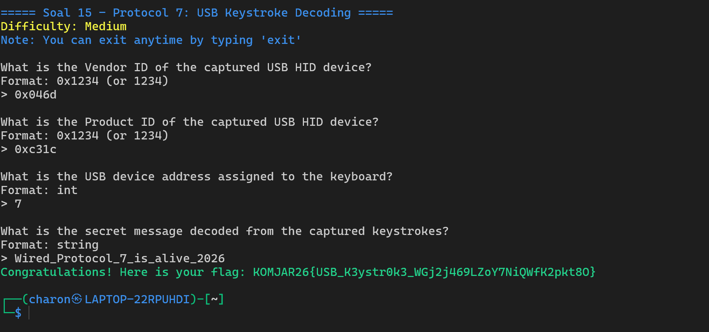
</p>

---

## 16. Analisis FTP Credential Theft

File `wired_ftp_theft.pcap` dianalisis menggunakan filter:

```text
ftp
```

Ditemukan sesi FTP menuju server eksternal. Informasi yang diperoleh adalah:

```text
FTP Server IP : 198.51.100.7
Software      : vsftpd 3.0.5
Username      : knights_agent
Password      : N4v1_s3cur3_2026
File          : knights_payload.exe
Size          : 524288 bytes
```

Informasi tersebut dapat terlihat langsung karena command FTP seperti `USER`, `PASS`, `SIZE`, dan `RETR` dikirim tanpa enkripsi.

<p align="center">
  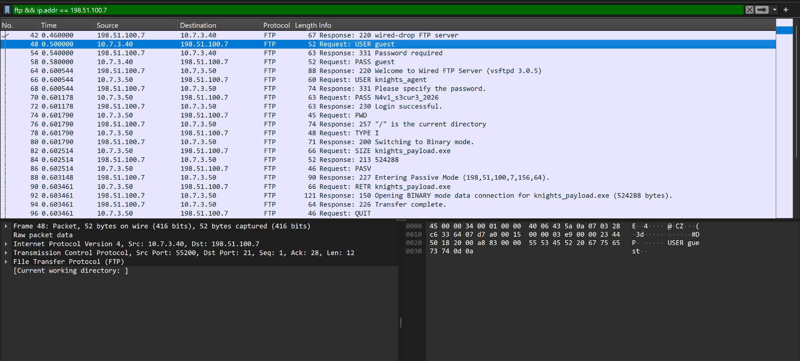
</p>

<p align="center">
  <i>Wireshark menunjukkan banner FTP, credential login, serta request file knights_payload.exe.</i>
</p>

Hasil analisis kemudian divalidasi melalui socket server.

<p align="center">
  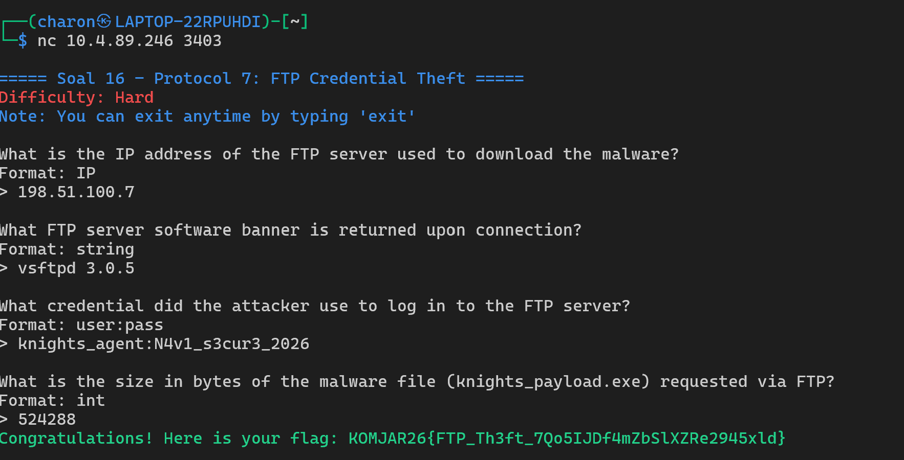
</p>

---

## 17. Analisis HTTP Malware Retrieval

Pada file `wired_http_c2.pcap` ditemukan client mengakses server eksternal untuk mengunduh executable melalui HTTP.

Traffic awal dapat dilihat dengan filter:

```text
http
```

<p align="center">
  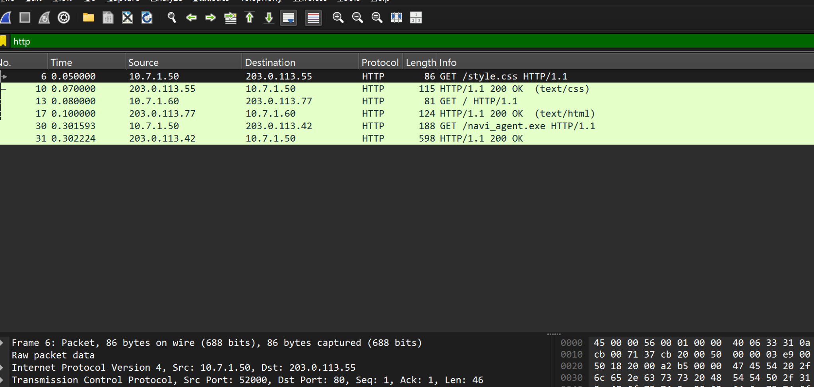
</p>

Dari request HTTP yang mencurigakan diperoleh:

```text
Domain        : wired-update.net
Server IP     : 203.0.113.42
File malware  : navi_agent.exe
HTTP response : 200
```

Request yang terlihat:

```text
GET /navi_agent.exe HTTP/1.1
Host: wired-update.net
```

<p align="center">
  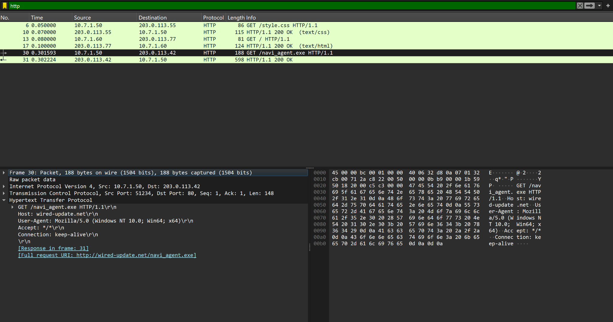
</p>

<p align="center">
  <i>Request HTTP menuju wired-update.net untuk mengunduh navi_agent.exe.</i>
</p>

Hasil analisis berhasil divalidasi pada socket server.

<p align="center">
  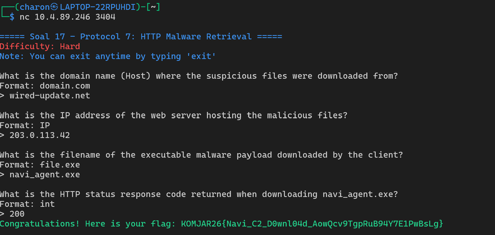
</p>

---

## 18. Analisis SMB Lateral Transfer

Capture `wired_smb_transfer.pcapng` dianalisis menggunakan filter:

```text
smb2
```

Terlihat host `10.7.3.100` mengakses administrative share pada host `10.7.1.50` dan menulis file executable ke directory `System32`.

Hasil analisis:

```text
Protocol : SMB2
Source   : 10.7.3.100
Victim   : 10.7.1.50
Folder   : System32
File     : wired_trojan_payload.exe
```

Pada Wireshark terlihat proses **Tree Connect**, **Create Request**, **Write Request**, dan **Close Request** terhadap file tersebut.

<p align="center">
  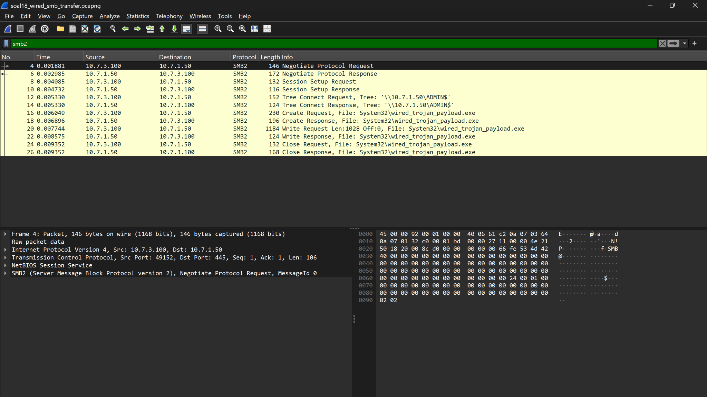
</p>

<p align="center">
  <i>Transfer wired_trojan_payload.exe melalui SMB2 dari source host menuju folder System32 pada victim.</i>
</p>

Hasil analisis berhasil divalidasi melalui socket server.

<p align="center">
  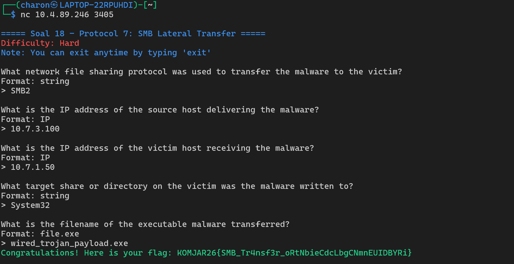
</p>

---

## 19. Analisis SMTP Threat

File `wired_smtp_threat.pcap` dianalisis menggunakan filter:

```text
smtp
```

Dari beberapa sesi SMTP yang terdapat pada capture, ditemukan email pemerasan yang dikirim oleh attacker. Isi email lengkap kemudian dilihat menggunakan **Follow TCP Stream**.

Hasil analisis:

```text
Victim email : victim@protocol7.co.jp
Password     : pr0tocol_7_user
Malware      : private ransomware
Deadline     : 3 hari
MailClientID : 7719980706
```

<p align="center">
  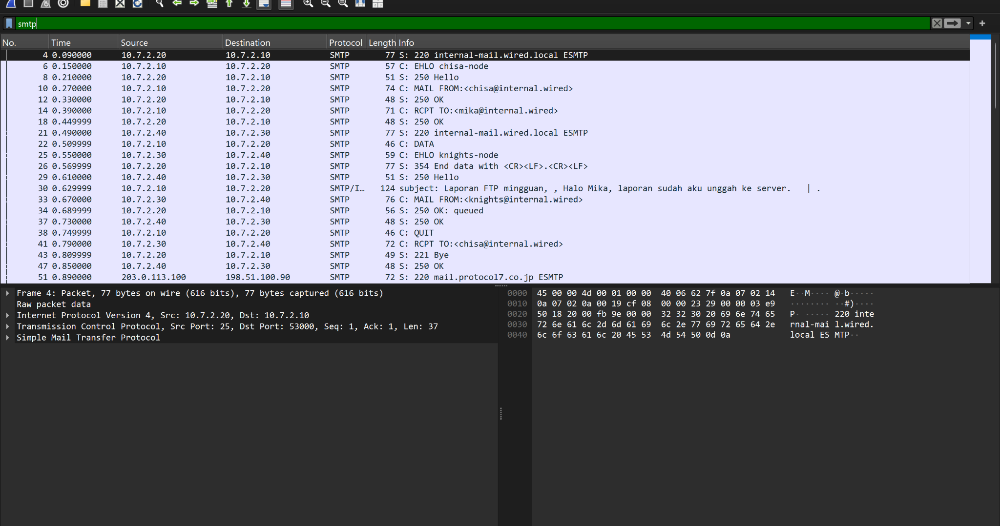
</p>

<p align="center">
  <i>Traffic SMTP pada file capture sebelum pemilihan stream email ancaman.</i>
</p>

<p align="center">
  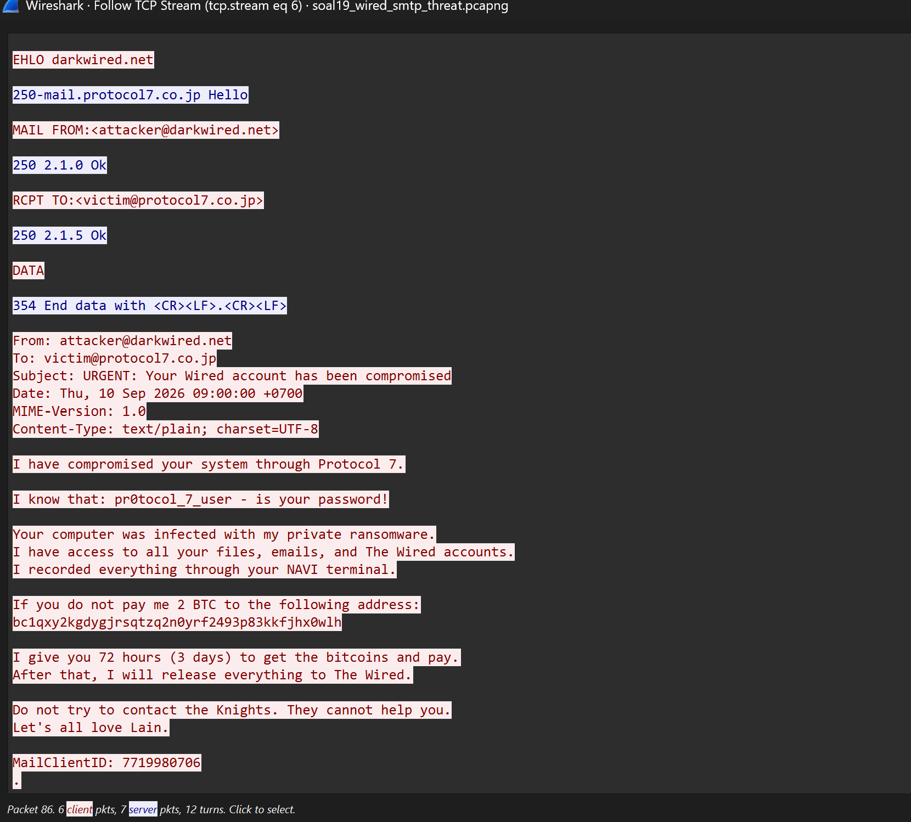
</p>

<p align="center">
  <i>Isi email pemerasan yang dikirim attacker kepada korban melalui SMTP plaintext.</i>
</p>

### Kendala

Pada awal analisis sempat dipilih stream SMTP lain yang merupakan spam biasa. Stream tersebut mendapat response:

```text
550 Blocked by spam filter
```

Karena stream tersebut tidak memiliki body email ancaman, pencarian dilanjutkan ke stream SMTP lain sampai ditemukan pesan extortion yang memiliki command `DATA` dan isi email lengkap.

Hasil akhir berhasil divalidasi pada socket server.

<p align="center">
  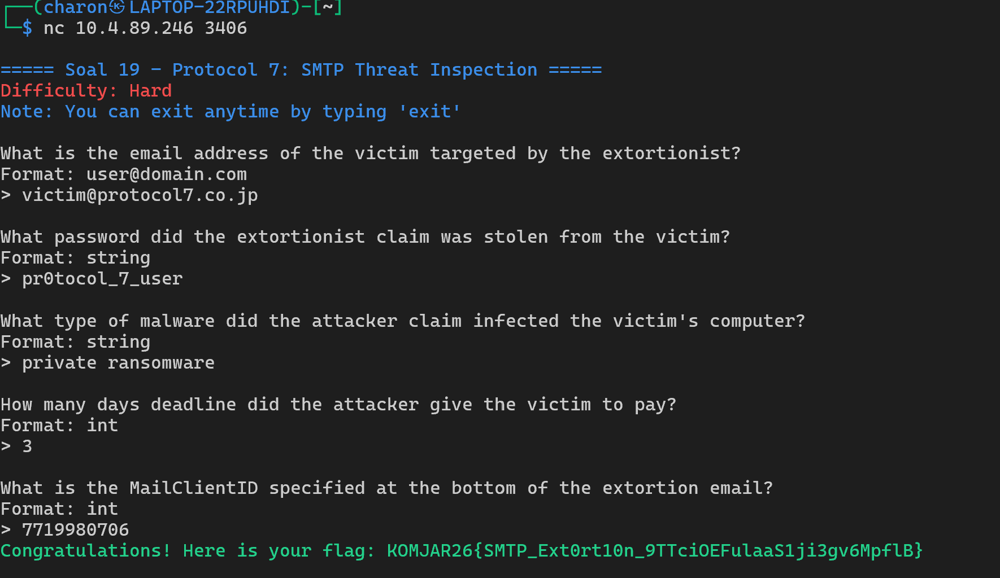
</p>

---

## 20. TLS Decrypted Stream

File `wired_tls_decrypt.pcapng` berisi komunikasi HTTPS yang terenkripsi. File `keyslogfile.txt` digunakan agar Wireshark dapat mendekripsi sesi TLS tersebut.

Keylog dimasukkan melalui:

```text
Edit
→ Preferences
→ Protocols
→ TLS
→ (Pre)-Master-Secret log filename
```

Setelah keylog dipasang, request HTTP di dalam sesi TLS dapat dibaca.

Hasil analisis:

```text
TLS Version : TLSv1.2
Domain      : example.com
Server IP   : 93.184.216.34
User-Agent  : curl/7.62.0
Request     : HEAD /
```

Pada paket **Server Hello** terlihat versi protokol yang dinegosiasikan adalah TLS 1.2. Cipher suite yang digunakan juga terlihat sebagai `TLS_ECDHE_RSA_WITH_AES_128_GCM_SHA256`.

<p align="center">
  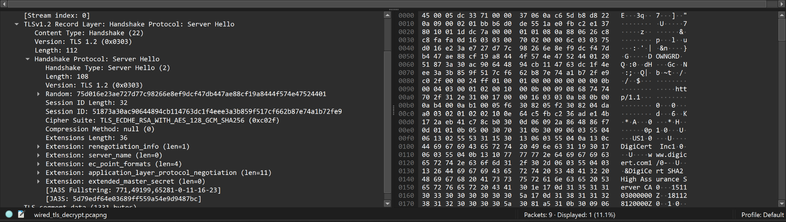
</p>

<p align="center">
  <i>Server Hello menunjukkan TLS 1.2 sebagai versi protokol yang digunakan.</i>
</p>

Setelah proses dekripsi, Wireshark dapat membaca request HTTP ke `example.com` pada port HTTPS.

<p align="center">
  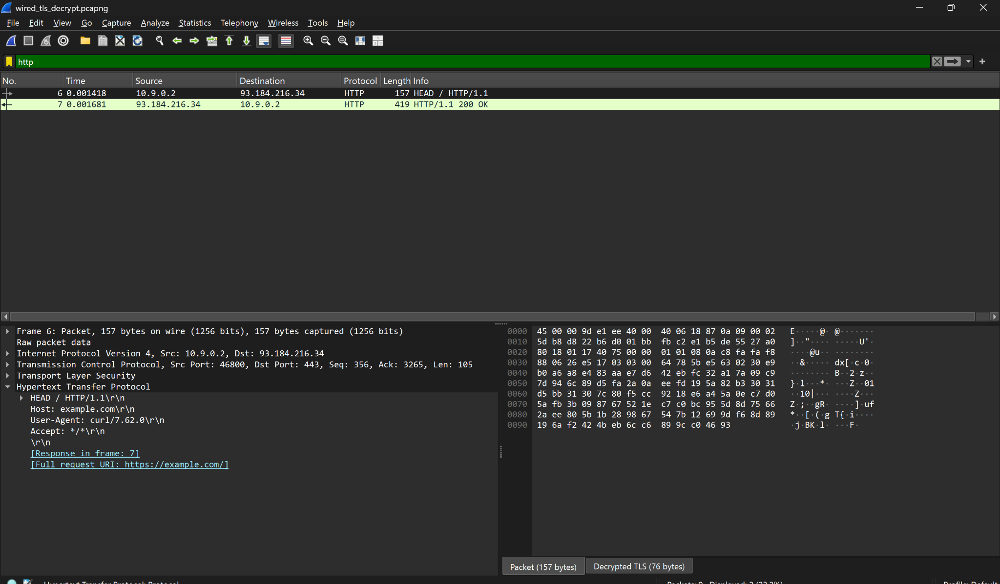
</p>

<p align="center">
  <i>Request HTTP hasil dekripsi menunjukkan Host example.com, User-Agent curl/7.62.0, dan method HEAD.</i>
</p>

### Kendala

Traffic HTTPS tidak dapat dibaca langsung karena payload berada dalam sesi TLS terenkripsi. Setelah `keyslogfile.txt` dimasukkan sebagai Pre-Master-Secret log file, Wireshark dapat mendekripsi Application Data sehingga request HTTP dapat dianalisis.

---


